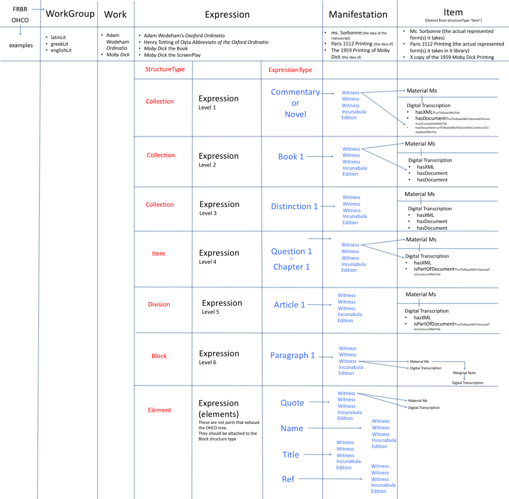
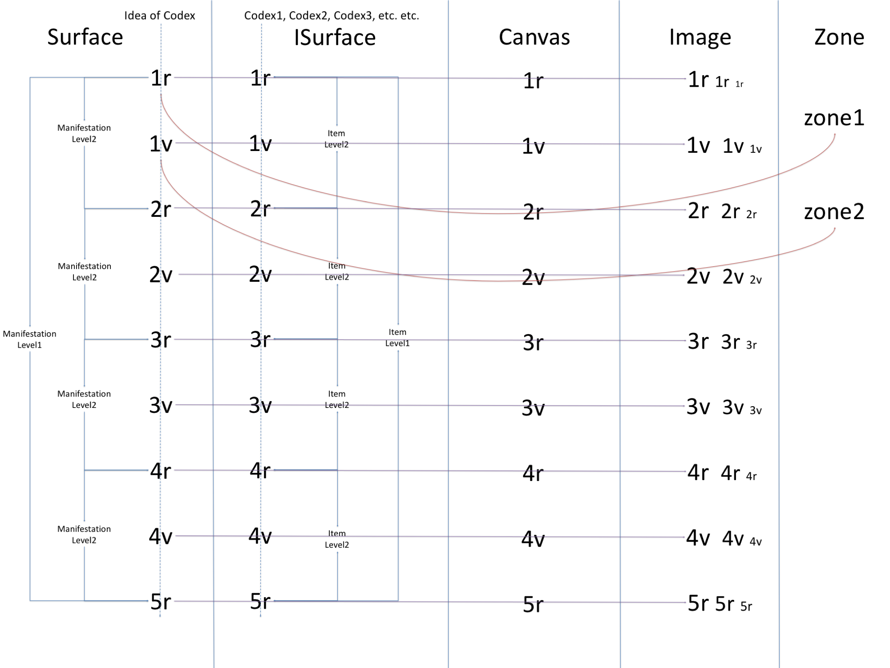

# Resource Types

## Resource

All resources inherit the global properties of the generic resource type

* rdf:type
  - etc.
* dc:title
  - e.g. Wodeham Oxford Reportatio
  - e.g. Wodheam Abbreviatio
  - Beethoven's 9th 1st Redaction
  - Beethoven's 9th 2nd Redaction
  - Moby Dick the Novel
  - Moby Dick the Screen Play
* dc:description
* [sctap:shortId](http://scta.info/property/shortId)
* ldp:inbox

## workGroup

* dcterms:isPartOf
    - if the workGroup is not level=1 it must specify its parent part. This must be another workGroup.
* dcterms:hasPart
    - a work group can take either another workGroup or a work as its direct part (or child)
* [sctap:hasExpression](http://scta.info/property/hasExpression)
    - every work group should list every expression contained within it, no matter what level
* [sctap:level](http://scta.info/property/level)
    - 1,2,3
* sctap:citation
    - a string offering a best practice example of how this should be cited

## Text
  A super class for grouping work with expressions, manifestations, and transcriptions

## Work

* role:author
* dcterms:isPartOf
    - a work should indicate the immediate parent workGroup of which it is a part.
* dcterms:hasPart
    - a Work (unlike a WorkGroup) can take no workGroups or Works as children and thus can only have a top level Expression as its immediate child part.
* sctap:citation
* sctap:hasExpression
* sctap:hasCanonicalExpression
* sctap:level

# textItem

A super class for expressions, manifestations, and transcriptions

## textItem Resources Chart

| ----- | [Expression](#expression) | [Manifestation](#manifestation) | [Transcription](#transcription) |
| ---------- | ---------- | ------------- | ------------- |
| [TopLevelStructureCollection](#toplevelstructurecollection) | [TopLevelCollectionExpression](toplevelcollectionexpression) | [TopLevelCollectionManifestation](#toplevelcollectionmanifestation) |  [TopLevelCollectionTranscription](#toplevelcollectiontranscription) |
| [StructureCollection](#structurecollection) | [ExpressionCollection](#expressioncollection) | [ManifestationCollection](#manifestationcollection) | [TranscriptionCollection](#transcriptioncollection) |
| [StructureItem](#structureitem) | [ExpressionItem](#expressionitem) | [ManifestationItem](#manifestationitem) | [TranscriptionItem](#transcriptionitem) |
| [StructureDivision](#structuredivision) | [ExpressionDivision](#expressiondivision) | [ManifestationDivision](#manifestationdivision) | [TranscriptionDivision](#transcriptiondivision) |
| [StructureBlock](#structureblock) | [ExpressionBlock](#expressionblock) | [ManifestationBlock](#manifestationblock) | [ItemBlock](#itemblock) |
| [StructureElement](#structureelement) | [ExpressionElement](#expressionelement) | [ManifestationElement](#manifestationelement) | [ItemElement](#itemelement) |

## Global textItem Resource Properties

* role:author
* role:editor (is this global? I think maybe only a manifestation can have an editor)
* role:contributor
* sctap:citation

## Expression

* rdf:type=http://scta.info/resource/expression
* sctap:status
* [sctap:expressionType](http://scta.info/property/expressionType)
    - e.g. available expressionTypes should be enumerated in the WorkType or WorkGroupType class
    - e.g. a Work within the WorkGroup where workGroupType="SentencesCommentaries" the value of expressionType given here must be one of the values of the availableExpressionType listed in that workGroupType. See WorkGroupType and WorkType below.
* [sctap:hasManifestation](http://scta.info/property/hasManifestation)
* [sctap:hasCanonicalManifestation](http://scta.info/property/hasCanonicalManifestation)
* [sctap:isPartOfTopLevelExpression](http://scta.info/property/hasCanonicalManifestation)<!-- I would like to see this change just isPartOfTopLevel and become a property of structures -->
    - all non top level Expressions should point to the top level Expression of which they are a part.

## Manifestation

* [sctap:manfestationType](http://scta.info/property/manifestationType)
    - e.g.
    - manuscript
    - incunabula
    - earlyEdition
    - modernEdition
    - bornDigitalEdition
* sctap:hasCanonicalTranscription
* sctap:hasTranscription
* sctap:isManifestationOf
    - Value must be an Expression
* sctap:isOnSurface (only at item, block, and element level)
* sctap:isOnZone (only block, and element level)

## Transcription

* [sctap:transcriptionType](http://scta.info/property/transcriptionType)
    - e.g.
    - diplomatic
    - critical
    - translation
* sctap:isTranscriptionOf
* sctap:hasXML
* sctap:hasDocument
* sctap:plaintext
* sctap:status

---

Note: The following are not classes but critical properties that that textItem classes can take
that effectively divide textItem classes into subclasses

--

## Global Structure properties

* sctap:structureType
    - structureCollection
    - sturctureItem
    - sturctureBlock
    - sturctureElement
* dcterms:isPartOf
    - a top level expression should point to the immediate parent Work (or WorkGroup) that contains the top level expression as a direct child
* dcterms:hasPart
  - the top level expression should list the immediate 2nd level child Expressions
* isPartOfTopLevelStructure
  - alias of isPartOfTopLevelExpression, isPartOfTopLevelManifestation, isPartOfTopLevelTranscription
  - applies at every level accept structureCollection level 1
* sctap:next
    - next should point to the next expression on the same level of the content hierarchy
    - obviously, a top level expression would not a have a next property because there is be definition now sibling of Expression of a top level Expression
* sctap:previous
    - next should point to the next expression on the same level of the content hierarchy
    - again, previous property does not apply to a top level Expression
* sctap:sectionOrderNumber
    - the order sequence position number among sibling Expression parts
* sctap:totalOrderNumber
    - the order sequence position number among all Expression parts on this level.
* sctap:level
    - the level of the expression within the Expression hierarchy

## TopLevelStructureCollection

* sctap:hasStructureItem

## StructureCollection

* sctap:hasStructureItem

## StructureItem

* sctap:hasStructureBlock

## StructureDivision

* sctap:hasStructureBlock

## StructureBlock

* sctap:isPartOfStructureItem
* sctap:hasStructureElement

## StructureElement

* sctap:isPartOfStructureBlock

## Virtual textItem Classes

---

Note: The following are not explicitly classes,
but could be considered sub classes that are the resultant combination of a
textItem class and a structure type

---
### TopLevelCollectionExpression
### ExpressionCollection
### ExpressionItem
### ExpressionBlock
### ExpressionElement
### TopLevelCollectionManifestation
### ManifestationCollection
### ManifestationItem
### ManifestationBlock
### ManifestationElement
### TopLevelCollectionTranscription
### TranscriptionCollection
### TranscriptionItem
### TranscriptionBlock
### TranscriptionElement

## marginalNote

* isPartOfStructureBlock
* isPartOfTopLevelManifestation
* structureType=structureElement
* structureElementType=structureElementMarginalNote
* structureElementText
* isOnSurface
* isOnZone

## person

* hasInstance
* personType
* owl:sameAs (this should be global)

# materialResource

A super class for materialResource subclasses

| MaterialManifestation | MatieralItem |
| ---------- | ---------- |
| [Codex](#codex) | [icodex](#icodex) |
| [Quire](#quire) | [iquire](#iquire) |
| [Folio](#folio) | [ifolio](#ifolio) |
| [Surface](#surface) | [isurface](#isurface) |
| [zone](#zone) | [izone](#izone) |

## codex

* sctap:hasCanonicalCodexItem
* sctap:hasSurface
  - range: sctar:surface
* dc:hasPart
  - range: e.g, sctar:quire

* structureType=structureCollection

## quire

* sctap:hasCanonicalQuireItem
* sctap:hasSurface
  - range: sctar:surface
* dc:hasPart
  - range: e.g sctar:folio, surface
* materialStructureType=materialStructureCollection
* isMemberOf
  - each ancestor of this quire (codex should be listed)

## folio

* sctap:hasCanonicalFolioItem
* sctap:hasSurface
  - range: sctar:surface
* dc:hasPart
  - range: sctar:quire or sctar:codex
* materialStructureType=materialStructureCollection
* isMemberOf
  - each ancestor of this folio (quire, codex should be listed)

## surface

* sctap:isPartOfCodex
* sctap:next
* sctap:previous
* dc:isPartOf
    - e.g. folio, quire, or codex
* dc:hasPart
    - range: directChildren
* sctap:hasZone
  - all descendant zones at any level
* materialStructureType=materialStructureItem
* isMemberOf
  - each ancestor of this surface (folio, quire, codex should be listed)

## zone

* sctap:zoneType
  - marginRight
  - marginCenter
  - marginLeft
  - marginBottom
  - marginTop
  - column
  - line
  - general
* sctap:isPartOfSurface
  - inverse of hasZone
* dc:isPartOf
  - range: sctar:surface, or line is part of column, marginal note could be part of margin
* materialStructureType=materialStructureBlock
* height
* width
* lrx
* lry
* ulx
* uly
* isMemberOf
  - each ancestor of this zone (surface, folio, quire, codex should be listed)

* Note on position/order
  * sctap:order?
    - default=1, where there is more than one zone for a given resource, (for example a paragraph that crosses from one column to the next) the zone should be given a order number so that the zones can be ordered correctly.
    - I think this should be removed and the manifestation pointing to more than one zone should indicate the order using a blank node, e.g hasZone->:bn->zone and order

## icodex

* canvasPagedType
* hasOfficialManifest
* isCodexItemOf
* sctap:hasISurface
  - range: sctar:isurface
* dc:hasPart
  - range: sctar:iquire
* materialStructureType=materialStructureCollection

## iquire

## ifolio

## isurface

## izone

#ElementQuotation and Reference Relations
---

Below Needs Substantial Review and Revision

---

Note on reference and quotation Properties (needs review)

The current working assumption is that `refs` get an `isInstanceOf` property
when they do NOT have a `@corresp` but do have an an `@ana` or an `@target`

but when, they have a `@corresp`, the quote is the `instanceOf` and the ref takes the
`isReferenceTo` property.  

Likewise, when they have a `@corresp` they should not have an `@ana` or `@source`
for again the quote is the instanceOf and the ref the source can be found by following
the `isReferenceTo` property to the quotation in question.

However, there is a complication.

Sometimes we have something like this:

>Item, <quote>omnia dona sunt omnibus commu-
nia</quote>, sicut dicit <ref>Gregorius</ref> et <ref>Magister in littera</ref>;
sed denominatio angelicorum ordinum flt a donis
gratuitis: ergo oinnia nomina eoruin debent esse
communia, quemadmoduin et dona.

In this case the quote is from Gregory and the gregory ref should have an `@corresp` but no `@ana` or `@target` because it will inherit this from the quote. But the Magister ref applies to the quote, but in a way is a reference to the place where Lombard quotes Gregory.
In this case, it seem like the ref should have an `@corresp` and a `@target`

Similar example:

>Item, <quote>omnia dona sunt omnibus commu-
nia</quote>, sicut dicit <ref>Magister in littera</ref>;
sed denominatio angelicorum ordinum flt a donis
gratuitis: ergo oinnia nomina eoruin debent esse
communia, quemadmoduin et dona.

In this case Bonavanture the author, uses a ref to Lombard as the reference for a quote by Gregory and Gregory remains unnamed.

For this reason, a `<ref>` should be allowed to take a `@target` property at the same time that is has an `@corresp`.

This basically means, here is a quote, without its own source. But here is a ref for this quote that points to the proxy source for the quote.

This would allow a query like the following. Show me all the quotes of Augustine that are quotations referenced through or attributed to Lombard.

The query would the `@source` attribute of the `quote` to find the quotes, and then check for references for this quote using the `corresp` or `isReferenceTo` property, and then check to see if the source for this reference is from Lombard.

This also mean that a ref with a corresp attribute could be wrapped in a `cit` tag with its own `bibl`. The `bibl` for the quote should a default modern reference for the actual quote. The `ref` that directly corresponds should take no `cit` or `bibl` because it is covered by the `quote` but the second `ref` with an `@source` and `@corresp` can take its own `bibl` which is the modern citation patter for the reference.

See Gracilis pg-b1q13 for a quotation of Apuleius through Augustine's city of God for another good example.
